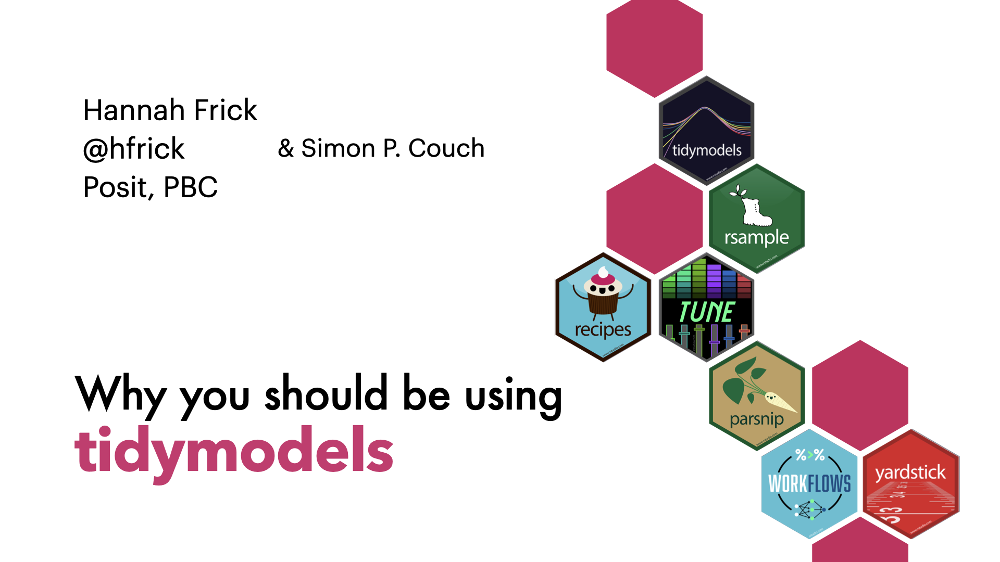

This repository contains source code and slides for the talk "Why you should be using tidymodels" at EMD Serono in March 2024, based largely on the [excellent talk](https://simonpcouch.github.io/tidymodels-uw-2023) by Simon Couch. 

The **slides** for the talk are available [here](https://hfrick.github.io/2024-tidymodels-emdserono).

To learn more about data science and machine learning with R,

- Data science with the tidyverse: [r4ds.hadley.nz](r4ds.hadley.nz)
- Machine learning with tidymodels: [tmwr.org](tmwr.org)
- More example notebooks with tidymodels: [tidymodels.org](tidymodels.org)

----

In this repository,

-   `index.qmd` contains the source code for the slides. The slides use images in the `/figures` directory.
-   `/example` contains the source code for the example.
